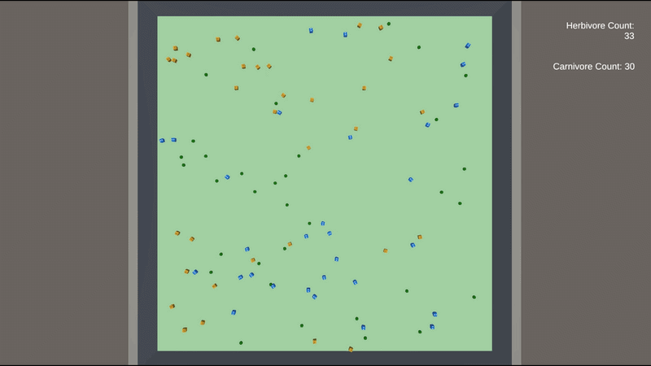

# EvoSphere

> A predator–prey coevolution simulation built in Unity.

EvoSphere is an artificial-life simulation where herbivores and carnivores are controlled by neural networks and evolve over successive generations.

Organisms perceive their environment using raycasts, make movement decisions through a neural network, consume food or prey to gain energy, reproduce when they have enough energy, and pass mutated neural-network parameters to their offspring.

The goal is to explore how complex behavior can emerge from simple rules involving perception, movement, energy, reproduction, and mutation.



## Features
- Neural-network controlled organisms
- Raycast-based environmental perception
- Neural-network mutation and inheritance
- Herbivore vs. carnivore interactions
- Dynamic food/resource population
- Energy-based survival system
- Evolution through reproduction
- Population statistics and graphs
- Interactive simulation
- Randomized simulation runs


## How It Works

Each organism repeatedly observes its surroundings, processes the information through a neural network, and uses the resulting outputs to control its movement.

```
┌──────────────────┐
│   Environment    │
└────────┬─────────┘
         │
         ▼
┌──────────────────┐
│     Raycasts     │
│   Perception     │
└────────┬─────────┘
         │
         ▼
┌──────────────────┐
│ Neural Network   │
│                  │
│  Input → Hidden  │
│       → Output   │
└────────┬─────────┘
         │
         ▼
┌──────────────────┐
│ Movement / Turn  │
└────────┬─────────┘
         │
         ▼
┌──────────────────┐
│ Find Food / Prey │
└────────┬─────────┘
         │
         ▼
┌──────────────────┐
│      Energy      │
└────────┬─────────┘
         │
         ▼
   Enough Energy?
      /       \
    No         Yes
    │           │
    │           ▼
    │      ┌───────────┐
    │      │ Reproduce │
    │      └─────┬─────┘
    │            │
    │            ▼
    │       Mutate Neural
    │        Network
    │            │
    └────────────┘
```
## Neural Network

The neural network is constructed dynamically based on the number of perception rays.

The default architecture is:
```
Input → 16 neurons → 8 neurons → 2 outputs
```

Each ray provides:
1. Distance to the detected object
2. Type of detected object

The organism's normalized movement speed is also provided as an input.

With five rays:
```
5 rays × 2 values + 1 speed value = 11 inputs
```

The two outputs control:
```
Output 0 → Movement
Output 1 → Turning
```
## Evolution

EvoSphere uses inheritance and mutation rather than traditional backpropagation-based training.

When an organism reproduces:
```
Parent
  │
  ▼
Copy Neural Network
  │
  ▼
Mutate Weights / Biases
  │
  ▼
  Child
  │
  ▼
New Generation
```

The child inherits the parent's neural-network parameters and receives random mutations.

Over many generations, behaviors that help organisms survive and reproduce can become more common within the population.

## Ecosystem

The simulation contains three main types of organisms/resources:

| Type | Role |
| ---- | ---- |
| Producer	| Food/resource for herbivores |
| Herbivore	| Consumes producers |
| Carnivore	| Hunts herbivores |

This creates a simple food chain:
```
 Producers
     │
     ▼
 Herbivores
     │
     ▼
 Carnivores
```

The populations interact continuously, creating changing environmental pressures for the organisms.

## Energy & Survival

Organisms have an energy level that changes throughout their lifetime.

Movement consumes energy, while consuming food or prey provides energy.

If an organism's energy reaches zero, it dies.

When an organism accumulates enough energy, it can reproduce.

This creates a basic survival pressure:
```
        Find Food
           │
           ▼
       Gain Energy
           │
     ┌─────┴─────┐
     │           │
 Not Enough   Enough
     │           │
     ▼           ▼
 Continue     Reproduce
 Surviving       │
                 ▼
             New Organism
```
## Perception

Organisms use configurable raycasts to perceive their surroundings.

The rays can detect:
- Producers
- Herbivores
- Carnivores
- Walls / obstacles

The information gathered by the rays is passed into the neural network.

This allows organisms to make decisions based on what they can actually perceive rather than using hard-coded targets.

## Population Visualization

EvoSphere records population data during the simulation.

The populations of:
- Producers
- Herbivores
- Carnivores

can be visualized over time.

This makes it possible to observe phenomena such as:
- Predator population growth
- Prey population decline
- Resource depletion
- Population oscillations
- Predator/prey imbalance
- Extinction events

## Controls

Main Controls:
| Key | Behavior |
| ---- | ---- |
| Scroll	| Zoom in/out |
| Arrows	| Move camera |
| G	| View a graph of population over time |
| R	| Reset simulation |

Each organism can be clicked on to view a more detailed information about the organism:
| Key | Behavior |
| ---- | ---- |
| T	| Toggle view |

with three views:
1. Top-down view
2. Low camera view facing the direction the organism is facing
3. View of the inputs and outputs to the neural network

## Built With
- Unity 6
- C#
- Universal Render Pipeline (URP)
- Unity Input System
- Unity AI Navigation
- TextMesh Pro

Unity Version: ```6000.1.0f1```

## Project Structure
```
EvoSphere/
│
├── Assets/
│   ├── Materials/
│   │
│   ├── Prefabs/
│   │   ├── Carnivore.prefab
│   │   ├── Herbivore.prefab
│   │   ├── Producer.prefab
│   │   ├── RandomOrganism.prefab
│   │   └── PlayableCharacter.prefab
│   │
│   ├── Scenes/
│   │   ├── Main Menu Scene.unity
│   │   ├── Simulation Scene.unity
│   │   └── Display.unity
│   │
│   ├── Scripts/
│   │   ├── GameManager.cs
│   │   ├── MainManager.cs
│   │   ├── OrganismManager.cs
│   │   ├── NeuralNetwork.cs
│   │   ├── OrganismMovement.cs
│   │   ├── RaycastDetection.cs
│   │   ├── GraphDisplay.cs
│   │   ├── DataViewCanvas.cs
│   │   ├── CameraController.cs
│   │   └── PlayerController.cs
│   │
│   ├── Textures/
│   └── Settings/
│
├── Packages/
├── ProjectSettings/
├── Images/
│   └── demo.gif
│
└── README.md
```

## Experiments

EvoSphere can be used as an artificial-life sandbox for experimenting with evolutionary behavior.

Some interesting experiments include:

### Mutation

How does changing the mutation rate affect evolution?
```
Low Mutation
    ↓
More conservative evolution

High Mutation
    ↓
More behavioral variation
```
### Population

What happens when the simulation starts with significantly more predators than prey?

### Food Availability

How does reducing the number of producers affect the herbivore and carnivore populations?

### Movement Cost

What happens when movement requires significantly more energy?

### Perception

How does changing the number or angle of perception rays affect the behavior that evolves?

## Possible Future Improvements
- Save and load evolved organisms
- Persist evolutionary lineages
- Export simulation data to CSV
- Save simulation results
- Deterministic simulation seeds
- Neural-network visualization
- More detailed evolutionary statistics
- Additional species
- More complex food chains
- Configurable mutation strategies
- Simulation replay system
- Automated large-scale experiments
- Improved ecosystem balancing


## Summary

EvoSphere is an exploration of artificial life, evolutionary algorithms, and neural-network-driven behavior.

Rather than explicitly programming every behavior an organism should perform, the simulation provides organisms with:
```
Perception
    +
Neural Network
    +
Movement
    +
Energy
    +
Reproduction
    +
Mutation
    ↓
Emergent Behavior
```
